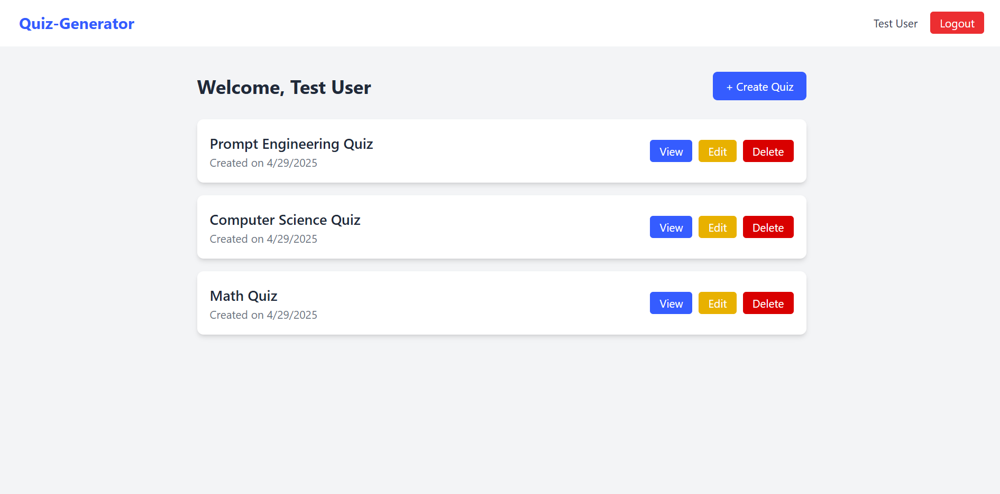
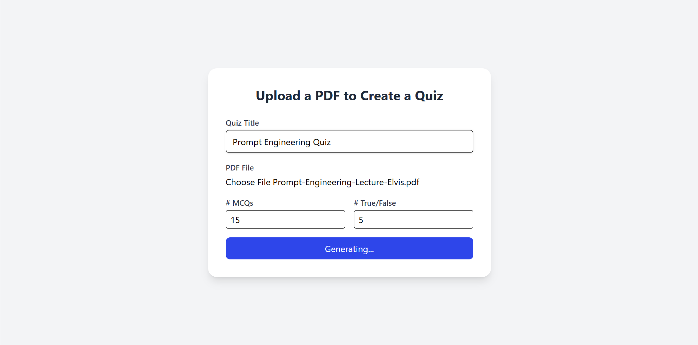
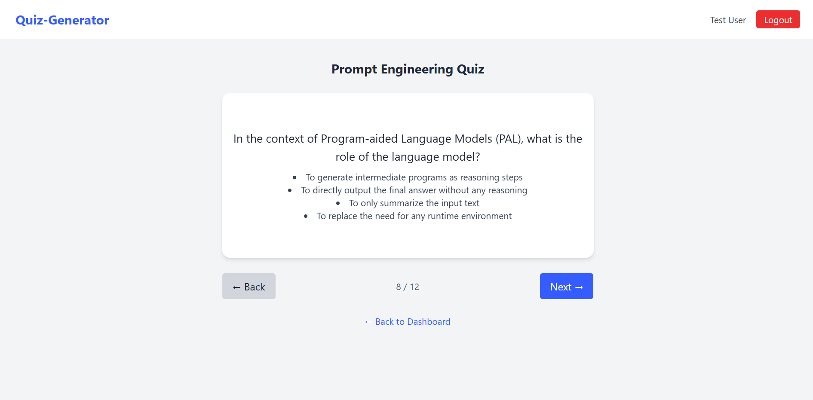
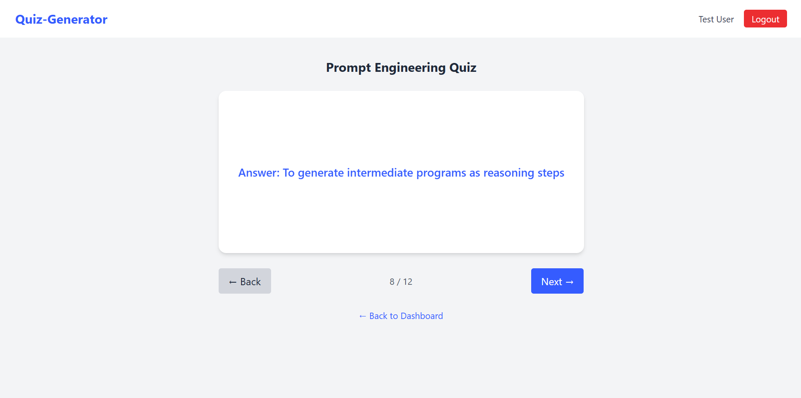

# AI Quiz Generator

A PDF-to-quiz generator that uses AI to extract content from lecture slides or notes and automatically generate multiple choice and true/false questions. Users can flip through flashcards, edit questions, and save personalized quizzes.

Live Site: https://quiz-generator-6hca.vercel.app/
## Tech

-   `React.js`
-   `Tailwind CSS`
-   `FastAPI`
-   `Supabase`
-   `OpenAI GPT-4.1`

## Screenshots

